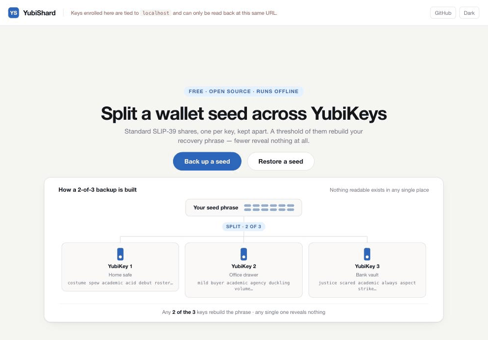

# yubishard



[](https://github.com/hosseinpro/yubishard/actions/workflows/test.yml)

Split a wallet recovery phrase into standard **SLIP-39** shares and store each one on a different
YubiKey. Any threshold of the keys rebuilds the phrase; fewer reveal nothing at all.

## Should you trust this with a seed phrase?

Typing a recovery phrase into a web page is normally terrible advice, so here is everything you
need to check that for yourself rather than take it on faith.

**Nothing leaves the tab.** `app.js` contains no `fetch`, no `XMLHttpRequest`, no WebSocket and
no dynamic import — after the page loads there is not a single network request it can make. There
is no analytics, no telemetry and no third-party script; `index.html` loads `styles.css` and
`app.js` from the same folder and nothing else. Nothing is written to `localStorage`,
`sessionStorage`, IndexedDB or a cookie. Your phrase lives in one tab's memory and is gone when
you close it. Check all of that with `grep` in under a minute, or watch the Network tab while you
use it.

**You can read the whole thing.** Three hand-written files, about 2,600 lines including the two
wordlists, no dependencies, no framework, no build step and no minification — so what ships is
literally what you read. Most projects asking for this much trust cannot be audited in an
afternoon; this one can. That is a deliberate choice with real costs — see
[Design philosophy](#design-philosophy).

**The crypto is checked against the official vectors, on every push.** The badge above is
`node test/run.mjs`: all 45 SLIP-39 vectors from Trezor's `python-shamir-mnemonic`, the BIP-39
English vectors, BIP-32 test vectors 1 and 2, the RIPEMD-160 vectors, and split/recover
round-trips. The vectors are committed, so you can run it yourself offline. The output has also
been cross-checked against Trezor's `shamir-mnemonic` package, so the encoder is verified by an
independent decoder rather than only by itself.

**Run it on your own machine.** The hosted copy at <https://yubishard.com/> exists for
convenience, but the intended path is to download the release, serve it at `localhost`, and pull
the network cable if you like. Keys enrolled at `localhost` are bound to a hostname nobody can
take away — see [the origin note](#things-you-have-to-know) for why that matters more than it
sounds.

**And what it does not protect you from.** A share on a key is guarded by that key's PIN, not by
encryption you control — largeBlob is not secret storage, and Yubico says so plainly. Anyone
holding enough keys *and* their PINs has your wallet. Those limits, and several others worth
knowing before you commit a real seed, are in
[Things you have to know](#things-you-have-to-know).

## Design philosophy

No dependencies. No package manager. No remote packages of any kind. No build step, no bundler,
no minifier, no framework — and every line of JavaScript in a single file.

**A dependency you have not read is trust you have delegated.** For a tool that handles recovery
phrases, that delegation is the whole ballgame. Supply-chain attacks on package registries are
routine, and a transitive update to some deeply nested library could exfiltrate a phrase without
a single character changing in this repository. There is no lockfile to audit here because there
is nothing to lock.

**A build step hides the thing you are actually running.** Bundled and minified output is not
what anyone reviews, and the gap between the source you read and the artifact you execute is
exactly where a backdoor lives. `index.html` loads `app.js` verbatim. What you audit is what
runs.

**One file, in reading order.** `app.js` runs wordlists → crypto primitives → SLIP-39 → BIP-39 →
WebAuthn → state → render → actions → wiring, top to bottom, so it can be read start to finish
instead of chased across a module graph. Section markers are the only comments; the code is
meant to be legible without them.

**The platform does the cryptography wherever it can.** SHA-256, SHA-512, HMAC and PBKDF2 all
come from the browser's own `crypto.subtle`. Only four primitives are hand-written, because
Chrome ships no equivalent — RIPEMD-160, secp256k1, the GF(256) field arithmetic and the RS1024
checksum. They are listed, with their reasons, under [Development](#development).

The cost of all this is paid once, by me, in code that has to be written by hand and proved
against the official test vectors. The benefit is paid every time someone else sits down to
review it before trusting it with a seed.

## Requirements

- **Google Chrome** on macOS or Windows 11 (Firefox will never work — see below)
- **Python 3** — only to serve the page locally
- **YubiKeys with firmware 5.7 or newer**, one per share. Check with `ykman info`. See
  [YubiKey firmware](#yubikey-firmware) — most keys already in circulation are too old, and no key
  can be upgraded. To try the tool before buying any, see
  [Trying it without a YubiKey](#trying-it-without-a-yubikey).

## Running it

You cannot open `index.html` directly. A security key identifies a site by its hostname, and a
`file://` URL has none — so WebAuthn refuses before anything else happens. The page must be served.

```
# macOS
./serve.command

# Windows
serve.bat
```

Either one serves this folder at `http://localhost:8000/` and opens Chrome. To do it by hand:

```
python3 -m http.server 8000 --bind localhost
```

There is also a hosted copy at <https://yubishard.com/>. It works, but read the origin note below
before enrolling keys there.

## How it works

1. Enter a **12- or 24-word BIP-39** phrase, or a **20-word SLIP-39** share (this is what a Trezor
   single-share backup is).
2. Choose a threshold — 3 of 5, say.
3. Write each share onto its own YubiKey. Chrome asks for the key's PIN and a touch twice: once to
   create the credential, once to store the share. A brand-new key has no PIN, so Chrome will ask
   you to set one — after that, unplug and reinsert the key before writing.
4. Verify by unplugging each key, plugging it back in, and reading the share off it. The flow will
   not finish until enough keys round-trip.

The shares are ordinary SLIP-39 mnemonics — Trezor, Electrum, Sparrow, Rabby and BlueWallet all
read them.

## Things you have to know

**The 20-word path is lossless. The 12/24-word path is not a conversion.**
A 20-word SLIP-39 input is re-split into the same master secret, so a Trezor restores the identical
wallet. A BIP-39 phrase is different: the shares carry its *entropy*, and BIP-39 and SLIP-39 derive
the wallet seed incompatibly. Typing those shares into a Trezor's Shamir recovery gives a valid,
empty, **different** wallet with no error. Restore through YubiShard, which re-encodes the entropy
back into your phrase. The BIP-32 fingerprint shown at every stage is what makes this visible.

**A BIP-39 passphrase is not stored in the shares.** It changes which wallet the phrase opens, and
so the fingerprint, but it is not part of the entropy. You must remember it separately.

**Shares are stored in plain form on the key.** They are encrypted at rest under a per-credential
key, but that key crosses the USB wire in the clear during a read. Yubico is explicit that largeBlob
"is not meant to be used to store sensitive data." The PIN is what stands between a stolen key and
its share.

**Record the PIN.** Eight wrong attempts locks the key's FIDO application, and recovering it means a
reset that destroys the share. A PIN forgotten across every key in the quorum cannot be recovered by
any means. `0000` is accepted if you would rather not manage one — but then possession of enough
keys is possession of the wallet.

**A YubiKey cannot be cloned.** Every key is enrolled independently, so your only redundancy is
enrolling more keys than the threshold.

**Nothing stops you writing two shares to the same key.** YubiShard refuses a key it has already
written to during the current session, but it cannot tell whether a key was used in an earlier one —
checking requires a query that leaves the key unresponsive until it is unplugged and reinserted, so
it is not done. Use a fresh key for each share and keep track yourself. `ykman fido credentials
list` shows what a key already holds.

Two shares on one key quietly weakens the scheme: a 3-of-5 where one key carries two shares is
really a 2-of-4, because that key counts twice. A key holding two shares also makes Chrome show a
credential picker every time it is read.

**Credentials are bound to the address you enrolled at.** A key enrolled at `localhost` cannot be
read at `yubishard.com`, or the other way round, and the tool cannot tell a wrong-origin key from a
blank one. Enrolling at `yubishard.com` means that if the domain ever lapses, those shares can never
be read again — there is no workaround, since a certificate error is not a secure context. Enrolling
at `localhost` binds to a name nobody can take away, and any static web server will do. Prefer it.

**Nothing is written to paper or disk.** No print, no download, no export. If you lose more keys
than the scheme tolerates, the backup is gone.

## Browser support

largeBlob is a WebAuthn Level 3 extension. Chrome implements it on macOS, Linux, ChromeOS and
Windows 11 — **not Windows 10**, which lacks it in `webauthn.dll`. Mozilla has stated Firefox does
not intend to implement it.

## YubiKey firmware

**Firmware is fixed when the key is manufactured and can never be updated.** There is no tool and no
Yubico service that does it — a key that could accept new firmware would be a key whose secrets
could be extracted by malicious firmware. A key below the requirement is replaced, not upgraded.

**Buy firmware 5.7 or newer.** largeBlob first appeared in firmware 5.5, but 5.5.x and 5.6.x shipped
only on the Bio Series. The mainline 5 Series — 5 NFC, 5C NFC, 5 Nano and the rest — went from 5.4.3
straight to 5.7, which reached retail on 2024-05-21. So although "5.5+" is what the extension itself
requires, 5.7 is the number to shop for.

| Firmware | largeBlob | Notes |
|---|---|---|
| YubiKey 4 and earlier, and 5.0 – 5.4.x | ❌ | No largeBlob. |
| 5.5.x, 5.6.x | ✅ 1024 B | Bio Series only. |
| 5.7+ | ✅ 4096 B | What to buy. Retail since May 2024. |

The stored record is capped at 900 bytes, so it fits in either capacity.

**Where to buy.** Prefer [Yubico's own store](https://www.yubico.com/store/) over a marketplace. If you buy elsewhere, verify the key at
[yubico.com/genuine](https://www.yubico.com/genuine/) and run `ykman info`.

Buy more keys than your threshold — a 2-of-2 means either loss destroys the backup.

## Trying it without a YubiKey

Chrome can emulate an authenticator that supports largeBlob, so the whole flow runs with no hardware
at all. This is for development and for seeing what the tool does — **never for a real backup**, as
the emulated key vanishes the moment you close DevTools.

1. Open DevTools, then ⋮ → **More tools** → **WebAuthn**.
2. Tick **Enable virtual authenticator environment**.
3. Add an authenticator with protocol **ctap2**, transport **usb**, and tick **Supports resident
   keys**, **Supports large blob** and **Supports user verification**.
4. Tick **User verified** on the authenticator once it is listed.

Registration and reads now resolve at once, with no PIN and no touch, and the panel lists each
credential as it is created. 

What emulation does not cover:

- The two PIN-and-touch ceremonies, which is most of what the flow feels like in practice.
- The size ceiling. The record is capped at 900 bytes against a real budget of about 1 KB, and an
  emulated authenticator will not push back on an oversized one.
- Reseating the key. The verification step asks for a physical unplug and replug; emulated, you are
  only re-reading.

## What is stored on each key

One JSON record per key, written to its FIDO2 large blob. The field names are deliberately verbose
and self-describing, because this is what someone reads years from now with `python-fido2` and no
access to this code:

```json
{
  "version": 1,
  "format": "bip39-128",
  "domain": "localhost",
  "quorum-share": "kitchen dream academic acid buyer fiscal mixed national fiscal benefit scatter fortune listen punish transfer romantic agree security timber sweater",
  "quorum-size": 3,
  "quorum-threshold": 2,
  "quorum-index": 0,
  "quorum-label": "Home safe",
  "bip32-fingerprint": "B8688DF1",
  "passphrase-protected": false,
  "created": "2026-08-21"
}
```

| Field | Meaning |
|---|---|
| `version` | Format version of this record. |
| `format` | `bip39-128`, `bip39-256` or `slip39-128` — where the secret came from. Without this a restore cannot know whether to re-encode the bytes as BIP-39 words or leave them as SLIP-39, and the bytes alone do not say. |
| `domain` | The relying-party ID the credential is bound to. A key enrolled at one address cannot be read at another. |
| `quorum-share` | This key's SLIP-39 mnemonic — 20 words for a 128-bit secret, 33 for 256-bit. Any SLIP-39 tool accepts it. |
| `quorum-size` | Total keys in the backup. |
| `quorum-threshold` | How many are needed to restore. |
| `quorum-index` | Which share this is, counting from zero. |
| `quorum-label` | The name you gave this key. |
| `bip32-fingerprint` | The wallet these words open on their own. |
| `passphrase-protected` | `true` if you said the wallet needs a passphrase. |
| `created` | ISO date. Informational only. |

About 400 bytes for a 128-bit backup and 495 for 256-bit, against the 900-byte cap. The rest is
headroom for the label, which is the only field that can grow — an over-long one is refused at
write time rather than silently truncated.

**The passphrase itself is never asked for, never used in any derivation, and never stored — only
the flag is.** That is what keeps it a second factor: someone holding enough keys still cannot open
a passphrase-protected wallet. It also means `bip32-fingerprint` is always derived with an *empty*
passphrase, so a restore can always recompute and check it. The corollary: if you use a passphrase, 
the fingerprint stored here will **not** match what your wallet shows.

## Where the randomness comes from

Every random byte in YubiShard comes from one source: the browser's `crypto.getRandomValues`, the
OS-backed CSPRNG. There is no `Math.random`, no fallback generator, and no seeding — and the
environment check refuses to run anywhere the API could be missing.

What actually rides on it: the random Shamir shares. SLIP-39's guarantee — fewer keys than the
threshold reveal *nothing* — holds exactly as long as those bytes are uniform, and here they are
the only line of defense: shares are deliberately encrypted with an empty passphrase (so a Trezor
can restore them without a prompt), which means the encryption layer contributes no secrecy of its
own.

The other uses need uniqueness, not secrecy: the 15-bit SLIP-39 identifier that stops shares from
different backups combining (a collision is caught by the digest check, harmlessly), the WebAuthn
user handle that keeps one key's credentials distinct, and the challenge each ceremony requires.

YubiShard never generates a wallet — the seed is always the one you type in. Randomness is drawn
fresh on every split, so running the same backup twice produces unrelated shares that do not mix.

## If this tool disappears

The share sits in a FIDO2 large blob on the key.
[`python-fido2`](https://github.com/Yubico/python-fido2) — Yubico's own library, installed with
`pipx install fido2` — can read it given the key's PIN, independently of this code. To do that you need the relying-party ID you enrolled at (`localhost`,
or the domain), so record that along with the threshold, the fingerprint and the PIN.

## Development

Three hand-written files — `index.html`, `styles.css` and `app.js` — with no dependencies and no
build step. Nothing bundles or transforms them, so what ships is what you edit. `node test/run.mjs`
checks the crypto against the official SLIP-39, BIP-39, BIP-32 and RIPEMD-160 vectors — CI runs it
on every push. See `CLAUDE.md` for the internals.

All hashing — SHA-256, SHA-512, HMAC, PBKDF2 — comes from the browser's own `crypto.subtle`. Four
primitives are implemented by hand because Chrome has no native for them:

| Section | ~Lines | Why it can't be a Chrome native |
|---|---|---|
| RIPEMD-160 | 75 | WebCrypto only ships SHA-family hashes |
| secp256k1 | 70 | WebCrypto has P-256, not Bitcoin's K-256; does base-point multiply only |
| GF(256) + interpolate | 35 | The Shamir field math; no native |
| RS1024 | 30 | SLIP-39's bespoke checksum |

The first two exist only to compute the BIP-32 fingerprint. The last two are the product.

## Reporting a vulnerability

Privately, please — see [SECURITY.md](SECURITY.md) for the route and what is in scope.

## Further reading

**SLIP-39 / Shamir backup**

- [SLIP39](https://trezor.io/slip39) — Trezor's explainer: why split a backup into shares, and how it compares to BIP-39.
- [Multi-share Backup on Trezor](https://trezor.io/guides/backups-recovery/advanced-wallets/multi-share-backup-on-trezor) — the same idea from the user's side.
- [SLIP-0039: Shamir's Secret-Sharing for Mnemonic Codes](https://github.com/satoshilabs/slips/blob/master/slip-0039.md) — the specification: share format, RS1024 checksum, and encryption of the master secret.
- [python-shamir-mnemonic](https://github.com/trezor/python-shamir-mnemonic) — the reference implementation, including the `vectors.json` test vectors this project is checked against.

**Storing data on a YubiKey (WebAuthn largeBlob)**

- [Web Authentication extensions § largeBlob](https://developer.mozilla.org/en-US/docs/Web/API/Web_Authentication_API/WebAuthn_extensions#largeblob) — MDN's description of the extension and its inputs and outputs.
- [WebAuthn: Emulate authenticators](https://developer.chrome.com/docs/devtools/webauthn) — the DevTools panel used above, and [the CDP WebAuthn domain](https://chromedevtools.github.io/devtools-protocol/tot/WebAuthn/) behind it.
- [FIDO2 large blobs](https://docs.yubico.com/yesdk/users-manual/application-fido2/large-blobs.html) — Yubico on the storage model and its ~1 KB budget.
- [fido-largeblob-demos](https://github.com/YubicoLabs/fido-largeblob-demos) — Yubico's working examples.
- [FIDO Specifics](https://docs.yubico.com/hardware/yubikey/yk-tech-manual/yk5-apps-fido.html) — the per-firmware extension table, and the source of the largeBlob version and capacity figures.
- [WebAuthn Level 3 § Large blob storage extension](https://www.w3.org/TR/webauthn-3/#sctn-large-blob-extension) — the normative definition.

**YubiKey**

- [How the YubiKey Works](https://www.yubico.com/products/how-the-yubikey-works/) — what the device is and what the touch actually does.
- [Setup](https://www.yubico.com/setup/) — Yubico's getting-started walkthrough.
- [YubiKey 5 firmware overview](https://docs.yubico.com/hardware/yubikey/yk-tech-manual/yk5-firmware-overview.html) — which firmware versions shipped on which products.
- [Firmware 5.7 now available](https://www.yubico.com/blog/now-available-for-purchase-yubikey-5-series-and-security-key-series-with-new-5-7-firmware/) — the May 2024 retail announcement, and Yubico confirming firmware cannot be retrofitted.

## Author

**Hossein Rezai** — security researcher, PhD in computer science, with doctoral work on
cryptocurrency wallets and custody. Previously led key management for
[Kraken Custody](https://www.kraken.com/institutions/custody).

More at [hosspro.com](https://www.hosspro.com/).

## License

MIT
